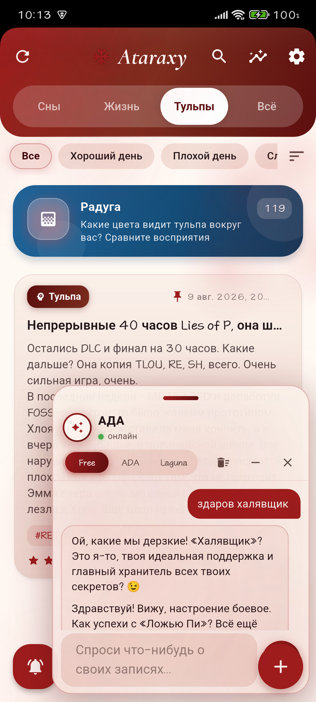
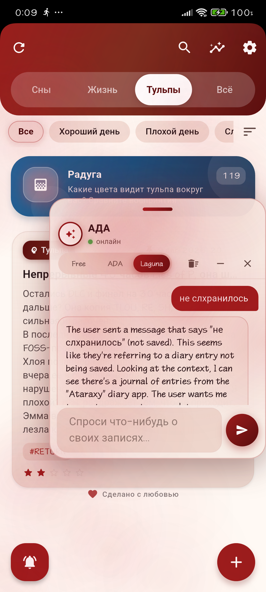
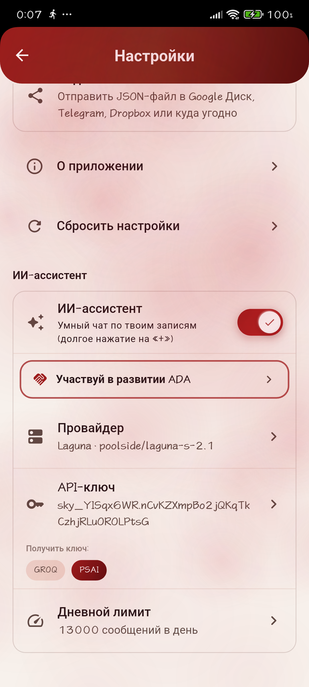

# Ataraxy

**Дневник снов и жизни с AI-ассистентом**


## 📌 Возможности

### 📔 Дневник
- **Четыре типа записей**: сны, жизнь, заметки, тульпа-форсинг
- **Настроение**: оценка 1–5, категории «хороший/плохой/случайный»
- **Осознанные сны**: отметка и отслеживание
- **Знаки снов**: каталог повторяющихся явлений
- **Трекинг жизни**: вода, голодание, помодоро, HRT, шаги
- **Закреплённые записи**: важное всегда сверху
- **Автоэкспорт**: ежечасные бэкапы в Downloads/Ataraxy
- **Экспорт/Импорт**: JSON для резервного копирования

### 🤖 AI-ассистент (АДА)
- Плавающий чат-пузырь поверх дневника
- Поддержка **бесплатных API**: Pollinations, AI Horde, OpenRouter, FreeLLM
- Работает с DeepSeek V4 Flash, Laguna, Gemini, Llama и другими
- Поддержка Markdown в ответах
- Цепочка мышления (thinking models)

### 📊 Статистика
- Графики настроения и категорий (fl_chart)
- Тепловая карта активных дней
- Знаки снов: частотность
- Помодоро таймер
- Шагомер (интеграция с Google Fit)

### 🔒 Приватность
- Экран блокировки с пин-кодом
- Все данные только на устройстве
- Шифрование резервных копий

### 🎨 Оформление
- **6 тем**: системная, светлая персиковая, лавандовая, светлая Grok, тёмная персиковая, MUTILATED
- Dynamic color (Material You) на Android 12+
- Кастомный шрифт Cormorant
- Анимированные переходы

### 🌍 Локализация
- Русский, English, Français

### 🔔 Напоминания
- Настраиваемые ежедневные уведомления
- Выживают после перезагрузки (BOOT_COMPLETED)
- Работают даже с агрессивной экономией батареи (MIUI/Redmi)

## 📱 Платформы

Android · iOS · Web · macOS · Linux · Windows

## 🛠️ Сборка

### Требования
- Flutter 3.47.0+ (Dart 3.13.0+)
- Android SDK 34+
- Java 17+

### Установка
[[!TIP]
Для сборки в пути с кириллицей добавьте в 
[android/gradle.properties]:
[android.overridePathCheck=true]
)

[```bash
flutter pub get
flutter build apk --release --split-per-abi --target-platform android-arm64 --no-tree-shake-icons
```

## 📂 Структура проекта

[```
lib/
├── main.dart                # Точка входа
├── app_shell.dart           # Главный шелл приложения
├── home_content.dart        # Главный экран
├── models/                  # Модели данных
├── screens/                 # Экраны приложения
├── services/                # Сервисы (AI, уведомления, экспорт)
├── theme/                   # Темы и стили
├── widgets/                 # Кастомные виджеты
└── l10n/                    # Локализация
```

## 🧪 Тестирование

[```bash
flutter test
```

## 📜 Лицензия

Проприетарное. Все права защищены.

## 📧 Контакты

GitHub: [wxstdo-boop/Ataraxy](https://github.com/wxstdo-boop/Ataraxy)

## 📸 Скриншоты





> Скриншоты сделаны на Redmi Note 12 (Android 13, MIUI 14)
